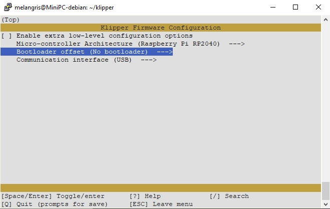

# Guía detallada Input Shaping usando RPI Pico y acelerómetro ADXL.

## Fuentes:
<https://github.com/bassamanator/rp2040-zero-adxl345-klipper>  
<https://klipper.discourse.group/t/raspberry-pi-pico-adxl345-portable-resonance-measurement/1757>  
<https://www.youtube.com/watch?v=aHQju3e2guE>
A partir de [aquí](https://youtu.be/aHQju3e2guE?t=1113) para la prueba en sí.  
<https://www.klipper3d.org/Resonance_Compensation.html>  
Para una explicación más técnica:
<https://klipper.discourse.group/t/interpreting-the-input-shaper-graphs/9879>

## Compilado klipper para rpi pico:

    cd ~/klipper/

    make menuconfig  
Seleccionar siguientes opciones y salvar:

    [ ] Enable extra low-level configuration options
    Miro-controller Architecture (Raspberry Pi RP2040)
    Bootloader offset (No bootloader)
    Communication interface (USB)

    make

Localizar y montar la partición de la RPI. Montarla y copiar la imagen para flashearla. Ej:

    sudo mount /dev/sdb1 /mnt
    cp ~/klipper/out/klipper.uf2 /mnt
    sudo umount /mnt

### Posibles complicaciones:

Si se reinicia el host o la RPI, esta no es recononocida por el host a menos que se reflashee.

## La prueba desde la consola mainsail:

Comprobar que se reconoce el acelerómetro:

    ACCELEROMETER_QUERY

Homing de los todos ejes de la impresora y comprobar el nivel de "ruido" que mide el acelerómetro. Lo ideal es que no supere los 100 puntos en ningún eje. Las vibraciones de los ventiladores son las que suelen inducir ruido.

    MEASURE_AXES_NOISE

Lanzar mediciones para los distintos ejes:

    Medición para análisis y configuración manual:
    TEST_RESONANCES AXIS=X
    TEST_RESONANCES AXIS=Y

    Medición y aplicación automática de resultados:
    SHAPER_CALIBRATE AXIS=X
    SHAPER_CALIBRATE AXIS=Y

## Configuración de klipper:

Si se ha ejecutado el test automático, ya está.

Si se ha optado por la configuración manual, los datos generados pueden encontrarse en: /tmp/resonances_<eje>_<fecha>_<hora>.csv. Los convertimos en gráficos legibles desde la consola linux:  

    ~/klipper/scripts/calibrate_shaper.py /tmp/resonances_x_*.csv -o /tmp/shaper_calibrate_x.png && ~/klipper/scripts/calibrate_shaper.py /tmp/resonances_y_*.csv -o /tmp/shaper_calibrate_y.png

Independientemente de la orientación en la que se haya montado el acelerómetro, el eje que se está probando será el del pico más alto.  

Eje X muestra la frecuencia en HZ que ha recorrido la prueba.  
El eje Y muestra la intensidad de la vibración. Sobre esta puede verse un código que normalmente estará entre 1e3 y 1e5. Es un multiplicador de potencias de 10 para a escala: 1eX = 10X  
Ej: 1e4 = 104 o el valor de la escala multiplicado por 10000.  

La línea azul clara contínua muestra la atenuación que supondría el uso del algoritmo recomendado.  
La línea de raya-punto muestra la reducción de vibración del input shaper recomendado.  
El resto de líneas punteadas muestran las reducciones en vibración del resto de input shapers.  

En el cuadro superior derecho, se muestran los detalles de cada input shaper:  
Frecuencia a la que se recomienda configurarlo.  
Control de vibración en % (menos es mejor).  
Smoothing: Ël exceso de corrección puede provocar que se suavicen demasiado cambios de sentido perdiendo detalle en las impresiones. Más bajo mejor.  
Accel: Aceleración máxima a la que puede usarse este input shaper y que siga siendo efectivo.  

### Como escojer el input shaper más adecuado:  

En general, dentro de los que cubren la velocidad deseada, queremos el que tenga un valor de control de vibración y smoothing más bajos.  

Cuando la vibración se concentra en un solo pico, normalmente se aplican ZV (Zero Vibration) o MZV (Magnitude Zero Vibration).  
Cuando la vibración se divide en varios picos, normalmente se aplica el shaper Ei que es más resistente a escenarios de vibraciones variables. También puede ser preferible en las slingers al ir variando el punto de resonancia cuando se imprimen objetos voluminosos que la cama debe mover.  

Interpretando las líneas, se busca que en los picos de vibración del eje medido tengan un reflejo negativo en el shaper:  
Que tenga los valores más bajos posibles en los picos de vibración del eje y que recupere bien fuera de estos para evitar smoothing.  
Se configura ese shaper entonces con el valor de frecuencia correspondiente al punto máximo de vibración del eje medido o, en el caso de varios picos, el valor intermedio entre el primer y el último pico.  

Detalles adicionales en el [vídeo](https://youtu.be/aHQju3e2guE?t=1606)

Plantilla configuración para módulo klipper Input Shaper:

    [input_shaper]
    shaper_freq_x: 
    shaper_type_x:
    shaper_freq_y: 
    shaper_type_y:
